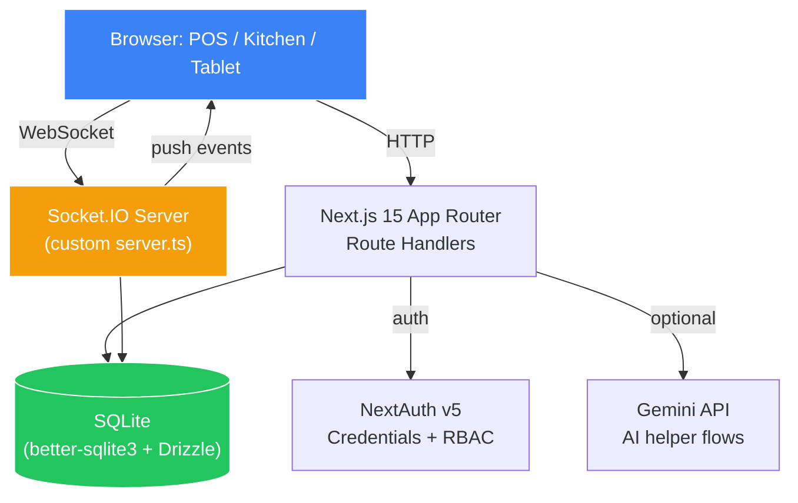

<div align="center">

<br/>

```
 ┌──────────────────────────────────────────────────────┐
 │            🍽️  Restaurant OS                           │
 │   Sistema completo de gestão de restaurantes.         │
 │   POS · KOT · Cozinha · Mesas · Estoque · Cardápio   │
 └──────────────────────────────────────────────────────┘
```

# 🍽️ Restaurant OS

### *Todas as mesas. Todos os pedidos. Uma tela.*

**Sistema operacional completo para restaurantes: POS em tempo real, KOT, gerenciamento de mesas, cozinha, estoque, reservas e cardápio online para clientes.**

<br/>

[](https://nextjs.org)
[](https://react.dev)
[](https://socket.io)
[](https://www.typescriptlang.org)
[](https://orm.drizzle.team)
[](https://authjs.dev)

<br/>

[**✨ Funcionalidades**](#-funcionalidades) · [**📺 Apps**](#-apps) · [**👥 Acessos**](#-acessos) · [**⚡ Início Rápido**](#-início-rápido) · [**💡 Arquitetura**](#-arquitetura)

<br/>

---

## 📁 Estrutura do Monorepo

```
restaurant-os/
├── app/                     # App principal (POS, KOT, Cozinha, Admin)
│   ├── (dashboard)/         # Dashboard, Pedidos, Cardápio, Estoque
│   ├── api/                 # API routes
│   ├── login/               # Tela de login
│   └── tablet/              # Pedido via tablet na mesa
├── customer-web/            # App para clientes (cardápio online)
│   └── src/app/             # Cardápio, Carrinho, Checkout
├── packages/
│   ├── shared/              # Tipos e utilidades compartilhados
│   └── ui/                  # Componentes UI compartilhados
├── server.ts                # Servidor Next.js + Socket.IO
├── middleware.ts             # Proteção de rotas por RBAC
└── db/                      # Schema Drizzle ORM + Seed
```

---

</div>

---

## 🎯 The Problem

Most restaurant software is fragmented or overpriced:

```
❌  POS, KOT, reservations, and inventory are separate tools
❌  Kitchen staff and waiters operate on different systems
❌  Table state is managed on paper or whiteboards
❌  Tablet ordering systems cost ₹4,000/month per outlet
❌  SaaS products are built for chains — not single-outlet operators
```

**Bhukkad is a single Next.js app that covers the entire service loop — front of house to back of house — in real time.**

---

## ⚡ Recruiter Quick Scan

| Signal | Details |
|---|---|
| 🏗️ **What it is** | Full-stack restaurant OS covering POS, KOT, table service, kitchen queue, tablet ordering, inventory, reservations, and reports |
| 🧠 **What it demonstrates** | Full-stack product execution · domain modeling · realtime WebSocket workflows · auth + RBAC · operator-first UI decisions |
| 🔑 **Differentiator** | Built around real restaurant service loops with Socket.IO state sync across POS, kitchen, and tables simultaneously |
| 🛠️ **Stack** | Next.js 15 · React 19 · TypeScript · NextAuth v5 · Drizzle ORM · SQLite · Socket.IO · Tailwind CSS |
| 🏆 **Built for** | AI Solutions Challenge 2026 — shipped end-to-end in a rapid build cycle |

---

## ✨ Features

### 📊 Dashboard
- Operational KPIs at a glance: covers, revenue, open tables, pending KOTs
- Live activity feed from all service areas
- Today's reservation preview

### 💳 POS & Table Service
```
  Host assigns table  →  Waiter opens order  →  Items added
          │
          ▼
  KOT sent to kitchen (Socket.IO push, <100ms)
          │
          ▼
  Kitchen marks ready  →  Waiter notified  →  Table served
          │
          ▼
  Cashier settles bill  →  Table cleared  →  Available again
```
- Split billing, modifiers, variants, void items
- Table status: Available / Occupied / Reserved / Cleaning
- Service charge, GST, discount controls

### 🍳 Kitchen KOT Queue
- Live ticket queue ordered by time and priority
- One-tap status updates: **Received → Preparing → Ready**
- Socket.IO push to POS the moment a dish is ready
- No page refresh needed — ever

### 📱 Tablet & QR Ordering
- Guests browse the menu on a tablet or scan a QR
- Orders go directly to the kitchen queue
- Modifiers, add-ons, and special requests supported
- Kitchen sees it in <100ms via Socket.IO

### 📖 Menu Management
- Categories, items, variants, and modifier groups
- Availability toggles (e.g., "86 the dal makhani")
- Image upload per item
- Combo and happy-hour pricing

### 📦 Inventory & Purchasing
- Stock levels tracked per ingredient
- Deduction on order confirmation
- Low-stock alerts
- Purchase order creation and supplier management

### 📅 Reservations & Customers
- Walk-in and advance reservation booking
- Customer profiles with visit history and loyalty tracking
- Table assignment from the reservation screen

### 📊 Reports
- Daily, weekly, and monthly revenue breakdowns
- Item-level sales analysis
- Staff performance metrics
- Export to CSV

---

## 📺 Product Surface

```
┌─────────────────────────────────────────────────────────────────┐
│  /dashboard        Operational KPIs + live activity feed          │
│  /pos              POS with table grid + order builder             │
│  /kitchen          KOT queue + real-time ticket management         │
│  /tables           Floor plan + table status management            │
│  /tablet-order     Guest-facing tablet/QR ordering interface       │
│  /menu             Categories, items, variants, modifiers          │
│  /inventory        Stock levels, low-stock alerts, purchasing      │
│  /customers        Profiles, loyalty, visit history                │
│  /reservations     Booking management + table assignment           │
│  /reports          Revenue, sales analysis, staff metrics          │
│  /settings         Outlet config, tax, charges, roles              │
└─────────────────────────────────────────────────────────────────┘
```

---

## 👥 Role-Based Access

| Role | Access Level | Default Demo Credentials |
|---|---|---|
| 👑 **Owner** | Full access to all modules + settings | `admin@admin.com` / `admin` |
| 📥 **Manager** | All ops, reports, no outlet config | `manager@spicegarden.com` / `Mgr@123` |
| 💰 **Cashier** | POS, billing, settlements | `cashier@spicegarden.com` / `Cash@123` |
| 👨‍🍳 **Kitchen** | KOT queue only | `kitchen@spicegarden.com` / `Kitch@123` |
| 👨‍🍴 **Waiter** | Table service, order taking | `waiter1@spicegarden.com` / `Wait@123` |

> All credentials are seeded demo data. Rotate before any real deployment.

---

## 💡 Architecture



**Key architectural decisions:**
- **Custom `server.ts`** — Next.js + Socket.IO share the same Node process; no separate WebSocket server
- **SQLite with Drizzle** — zero-config, portable, perfect for single-outlet demos and fast local builds
- **Socket.IO rooms** — POS, kitchen, tables, and outlet each get their own room for targeted push events
- **NextAuth v5 RBAC** — role-based route protection enforced at both middleware and route-handler level

---

## ⚡ Início Rápido

### Pré-requisitos
- Node.js 20+
- npm

### Setup Local

```bash
# Clone o repositório
git clone https://github.com/lucbruna/restaurant-employee-details.git
cd restaurant-employee-details

# Instale as dependências
npm install
cd customer-web && npm install && cd ..

# Configure o ambiente
cp .env.example .env.local
# Edite .env.local — gere um AUTH_SECRET com: openssl rand -base64 32

# Construa o banco e dados de demonstração
npm run db:setup

# Inicie o servidor principal
npm run dev
# → http://localhost:3000

# Em outro terminal, inicie o app do cliente
npm run dev:customer
# → http://localhost:3001
```

### Login with Demo Credentials

After `db:setup`, these users are ready:

```
Owner    →  admin@admin.com            / admin      (PIN: 1111)
Manager  →  manager@spicegarden.com    / Mgr@123    (PIN: 2222)
Cashier  →  cashier@spicegarden.com   / Cash@123   (PIN: 3333)
Kitchen  →  kitchen@spicegarden.com   / Kitch@123  (PIN: 5555)
Waiter   →  waiter1@spicegarden.com   / Wait@123   (PIN: 4444)
```

---

## 🛠️ Scripts Reference

| Script | What it does |
|---|---|
| `npm run dev` | Start custom Next.js + Socket.IO dev server via `tsx server.ts` |
| `npm run build` | Build Next.js app + compile `server.ts` into `dist/server.js` |
| `npm run start` | Run production server from `dist/server.js` |
| `npm run start:render` | Render-safe boot: schema push → seed if empty → start |
| `npm run db:setup` | **Rebuild DB from scratch** → push schema → reseed demo data |
| `npm run db:push` | Push Drizzle schema **without** resetting existing data |
| `npm run db:seed` | Reseed demo data (no schema changes) |
| `npm run db:studio` | Open Drizzle Studio for DB inspection |
| `npm run db:reset` | Remove SQLite file + WAL/SHM sidecars for a clean rebuild |
| `npm run lint` | Run ESLint |
| `npm run clean` | Clear Next.js build artifacts |

---

## 🌍 Deployment: Render

A `render.yaml` blueprint is included for a single Render web service.

```bash
# Required environment variables before first deploy:
AUTH_SECRET=<long random secret for NextAuth>
APP_URL=https://your-app.onrender.com
SOCKET_ALLOWED_ORIGINS=https://your-app.onrender.com
```

**Render boot flow:**
1. `npm ci && npm run build`
2. On start: `npm run start:render` — pushes schema, seeds if DB is empty, starts production server
3. Existing data is **never overwritten** on restarts

> Free tier uses local SQLite — suitable for demos. For persistent storage, attach a disk and override `SQLITE_DB_PATH=/var/data/sqlite.db`.

---

## 📦 Environment Variables

| Variable | Required | Description |
|---|---|---|
| `AUTH_SECRET` | ✅ Yes | NextAuth signing secret (generate with `openssl rand -base64 32`) |
| `APP_URL` | ✅ Yes | Canonical app URL (used for Socket fallback origin) |
| `APP_DEMO_MODE` | ⚠️ Local only | Demo-mode bypass toggle — keep `false` for production |
| `SOCKET_ALLOWED_ORIGINS` | ✅ Prod | Comma-separated Socket.IO CORS origins |
| `GEMINI_API_KEY` | ❓ Optional | For AI helper flows |
| `SQLITE_DB_PATH` | ❓ Optional | Override SQLite path (useful for Render persistent disk) |
| `HOSTNAME` / `PORT` | ❓ Optional | Custom host/port for the Node server |

See [.env.example](.env.example) for the full list.

---

## 🧰 Tech Stack

| Layer | Tooling | Why |
|---|---|---|
| **Framework** | Next.js 15 App Router | Server components + route handlers in one codebase |
| **Runtime** | React 19 | Concurrent features + server actions |
| **Language** | TypeScript (strict) | Type-safe domain model across menus, orders, and kitchen state |
| **Auth** | NextAuth v5 credentials | Role-based access across 5 user types |
| **ORM** | Drizzle + better-sqlite3 | Type-safe queries, zero-config, fast local dev |
| **Realtime** | Socket.IO | Sub-100ms push events across POS, kitchen, and tables |
| **Styling** | Tailwind CSS v4 + Radix UI | Operator-grade UI without a design system overhead |
| **State** | TanStack Query + Zustand | Server state sync + client-side cart/session state |
| **Forms** | React Hook Form + Zod | Validated order and menu forms |
| **Charts** | Recharts | Revenue and sales visualisations in reports |
| **Tables** | TanStack Table | Sortable, filterable data grids for menu and inventory |

---

## 📁 Project Structure

```
📦 Bhukkad
├── app/              App Router pages, layouts, and route handlers
├── components/       UI primitives + product-specific interface components
├── db/               Drizzle schema, DB bootstrap, and seed data
├── docs/             Technical documentation and handoff material
├── lib/              Auth, order workflows, validations, shared server logic
├── public/           Static assets and uploaded files
├── server.ts         Custom Next.js + Socket.IO server entrypoint
├── middleware.ts      Route protection for page requests
├── BRANDING.md       Brand system reference for UI work
├── CLAUDE.md         Claude Code project memory
└── AGENTS.md         General agent handoff document
```

---

## 📖 Documentation Map

| Document | Contents |
|---|---|
| [docs/README.md](docs/README.md) | Documentation index |
| [docs/RECREATION_GUIDE.md](docs/RECREATION_GUIDE.md) | Source-of-truth rebuild order and exact recreation rules |
| [docs/UI_SYSTEM.md](docs/UI_SYSTEM.md) | Implemented visual system and shell behavior |
| [docs/PAGE_BLUEPRINTS.md](docs/PAGE_BLUEPRINTS.md) | Page-by-page product blueprint |
| [docs/ARCHITECTURE.md](docs/ARCHITECTURE.md) | Runtime and module layout |
| [docs/API_ENDPOINTS.md](docs/API_ENDPOINTS.md) | Route handler inventory |
| [docs/DATABASE_SCHEMA.md](docs/DATABASE_SCHEMA.md) | Schema overview by domain |
| [docs/TECH_STACK.md](docs/TECH_STACK.md) | Concrete dependency and runtime stack |
| [docs/DEVELOPMENT_WORKFLOW.md](docs/DEVELOPMENT_WORKFLOW.md) | Common dev loops and verification expectations |
| [BRANDING.md](BRANDING.md) | UI and brand rules |

> **If you want to recreate Bhukkad exactly:** start with `docs/RECREATION_GUIDE.md` → `docs/UI_SYSTEM.md` → `docs/PAGE_BLUEPRINTS.md`

---

## ⚠️ Runtime Notes

- Use `npm run dev` and `npm run start` (not raw `next dev`) — the custom `server.ts` must be in the chain for Socket.IO to work
- `/api` routes are not protected by middleware; they enforce auth inside each handler with `auth()`
- State is local to `sqlite.db` by default; use `SQLITE_DB_PATH` for isolated runs
- Uploads write to `public/uploads` — ephemeral on free Render/Vercel; move to object storage for production
- Seed data installs sample avatars, menu imagery, and realistic restaurant records for local demos

---

<div align="center">

<br/>

**Built with ❤️ for every restaurant operator who deserved better software by [Adarsha Chatterjee](https://www.linkedin.com/in/iamadarsha)**

[](https://lego-portfolio-ochre.vercel.app)
[](https://www.linkedin.com/in/iamadarsha)
[](https://github.com/iamadarsha)

*Bhukkad — because every hungry table deserves a system that keeps up.*

</div>
