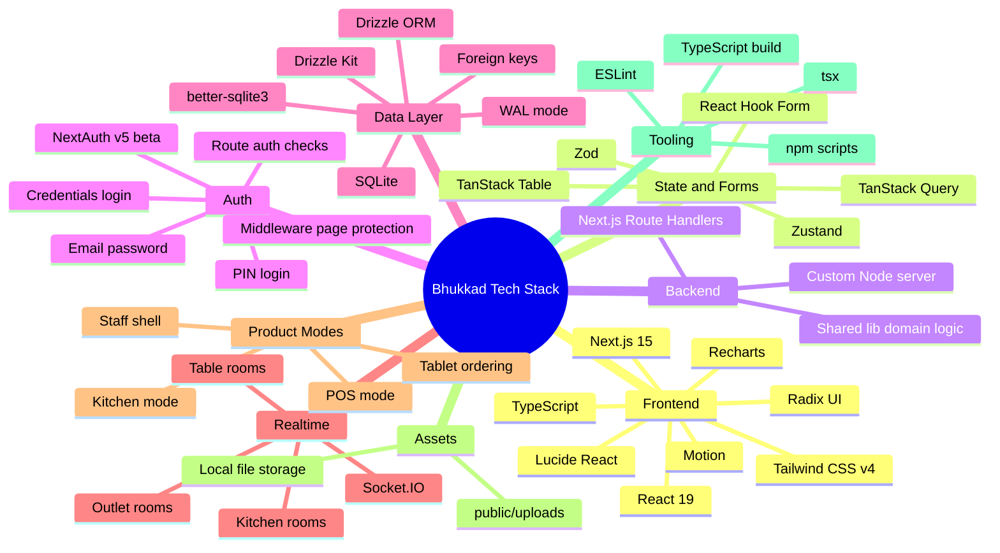

# Bhukkad Tech Mindmap

```mermaid
mindmap
  root((Bhukkad Tech Stack))
    Frontend
      Next.js 15
      React 19
      TypeScript
      Tailwind CSS v4
      Radix UI
      Lucide React
      Motion
      Recharts
    State and Forms
      TanStack Query
      TanStack Table
      React Hook Form
      Zod
      Zustand
    Backend
      Custom Node server
      Next.js Route Handlers
      Shared lib domain logic
    Auth
      NextAuth v5 beta
      Credentials login
      Email password
      PIN login
      Middleware page protection
      Route auth checks
    Data Layer
      SQLite
      better-sqlite3
      Drizzle ORM
      Drizzle Kit
      WAL mode
      Foreign keys
    Realtime
      Socket.IO
      Kitchen rooms
      Outlet rooms
      Table rooms
    Product Modes
      Staff shell
      POS mode
      Kitchen mode
      Tablet ordering
    Assets
      public/uploads
      Local file storage
    Tooling
      npm scripts
      ESLint
      tsx
      TypeScript build
```
