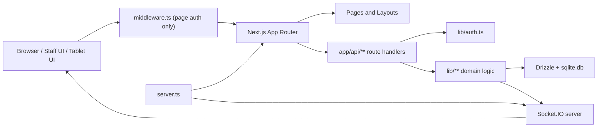

# Bhukkad Architecture

## System Overview

Bhukkad is a single-process restaurant operations system built on Next.js App Router with a custom Node server. The repository combines page rendering, API route handlers, authentication, realtime events, file uploads, and SQLite persistence in one deployable application.

## Runtime Shape

## Important Architectural Facts

- `server.ts` is the true application entrypoint for dev and prod runtime behavior.
- `middleware.ts` protects page navigation but explicitly excludes `/api`.
- Protected API handlers enforce auth inside the route handler with `auth()`.
- SQLite is the only persistence layer in the current repo.
- Uploads are stored on local disk in `public/uploads`.
- Realtime updates are in-process Socket.IO events.

## Route Surface

### Public or mostly public routes

- `/login`
- `/tablet/[tableId]`
- `/api/auth/[...nextauth]`
- `/api/tablet/session`

### Authenticated staff route group

Routes under `app/(dashboard)` are wrapped by a dashboard layout that redirects unauthenticated users to `/login`.

Primary pages:

- `/dashboard`
- `/pos`
- `/tablet-ordering`
- `/kot`
- `/kitchen`
- `/orders`
- `/reservations`
- `/menu`
- `/inventory`
- `/customers`
- `/reports`
- `/settings`

## Directory Roles

### `app/`

- App Router layouts and pages
- API route handlers under `app/api`
- Public tablet route and protected dashboard route group

### `components/`

- Layout shell, sidebar, header, breadcrumbs
- UI primitives
- Product-specific panels and sections

### `db/`

- `schema.ts` - source of truth for the data model
- `index.ts` - SQLite bootstrap
- `seed.ts` - demo seed data

### `lib/`

- Auth and demo mode
- Order creation and domain logic
- Tablet ordering settings and helpers
- Validation and utility functions

### `public/`

- Brand and product imagery
- avatars and demo assets
- uploaded files in `uploads/`

## Core Subsystems

## 1. Authentication

- Implemented in `lib/auth.ts`
- Uses NextAuth credentials provider
- Supports:
  - email + password login
  - PIN-based login for staff workflows
- Session data includes:
  - user id
  - role
  - permissions
  - outlet id

## 2. Dashboard Shell

- `app/(dashboard)/layout.tsx` gates the staff app
- `components/layout/app-shell.tsx` composes sidebar + header + scrollable main content
- `components/layout/sidebar.tsx` is the authoritative nav definition
- Header is intentionally hidden on `/pos` and `/kitchen` for focused operational screens

## 3. Order Lifecycle

Main files:

- `app/api/orders/route.ts`
- `app/api/orders/history/route.ts`
- `app/api/orders/[id]/pay/route.ts`
- `lib/orders/create-order.ts`
- `app/api/kitchen/kots/[id]/route.ts`

Flow:

1. POS or tablet flow submits items.
2. `createOrder()` validates menu item and variant availability.
3. Order, order items, KOT, and KOT items are created in one transaction.
4. Table state is updated if relevant.
5. Socket events notify kitchen and POS surfaces.
6. Payment flow closes the order and can release the table.

## 4. Kitchen and KOT Realtime

Socket.IO listeners in `server.ts`:

- `kitchen:join`
- `pos:join`
- `table:select`
- `kot:markStatus`

Important emitted events:

- `kot:new`
- `kot:updated`
- `table:updated`

Participating files:

- `server.ts`
- `lib/orders/create-order.ts`
- `app/api/kitchen/kots/[id]/route.ts`
- `app/api/orders/[id]/pay/route.ts`
- `app/(dashboard)/kitchen/page.tsx`
- `app/(dashboard)/pos/page.tsx`

## 5. Tablet Ordering

Main files:

- `app/tablet/[tableId]/page.tsx`
- `app/api/tablet/session/route.ts`
- `lib/tablet-ordering.ts`
- `app/api/settings/route.ts`

Behavior:

- The tablet route loads a table-specific session.
- The API bootstraps outlet, table, menu categories, items, variants, and modifiers.
- Outlet settings determine whether tablet ordering is enabled.
- Tablet orders are translated into standard dine-in orders through `createOrder()`.

## 6. Menu and Configuration

Menu configuration is spread across:

- `app/api/menu/categories/**`
- `app/api/menu/items/**`
- `app/api/menu/modifierGroups/**`
- `app/api/menu/modifiers/**`

The settings surface persists outlet-level configuration and merges tablet ordering flags through `mergeOutletSettings`.

## 7. Inventory and Reporting

Inventory files:

- `app/api/inventory/**`
- `app/(dashboard)/inventory/page.tsx`

Reporting files:

- `app/api/dashboard/overview/route.ts`
- `app/api/reports/summary/route.ts`
- `app/(dashboard)/reports/page.tsx`

## Data Ownership Model

Most staff-facing data is outlet-scoped. Route handlers typically:

1. call `auth()`
2. verify the user has an `outletId`
3. query or mutate only records tied to that outlet

This is one of the most important patterns to preserve when adding new APIs.

## Deployment Shape Today

The current repository is designed around:

- one Node server process
- one SQLite file
- local asset storage
- in-memory Socket.IO coordination

That makes local development simple and fast, but it also means horizontal scaling is not drop-in.

## Related Docs

- [API_ENDPOINTS.md](API_ENDPOINTS.md)
- [DATABASE_SCHEMA.md](DATABASE_SCHEMA.md)
- [TECH_STACK.md](TECH_STACK.md)
- [DEVELOPMENT_WORKFLOW.md](DEVELOPMENT_WORKFLOW.md)
